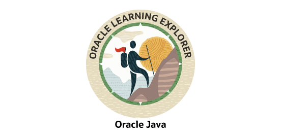

# ☕ Oracle Java Foundations — Oracle University


This repository contains my code and exercises from the **[Java Foundations](https://mylearn.oracle.com/ou/learning-path/java-foundations/79726)** learning path on Oracle University — a free introductory course guided by instructor **Joe Greenwald**, Oracle Learning Solutions Architect.

The course is part of the **Java SE 11 Developer Learning Path** and serves as a foundation toward the [Java SE 11 Developer (1Z0-819) certification](https://education.oracle.com/java-se-11-developer/pexam_1Z0-819).

## 💡 Why This Course

I found this course very useful not only for review, but also for learning new concepts — especially from Joe's career experience and expertise, which he shares throughout. The course provides rich background on the history and core principles of Object-Oriented Programming (OOP) in Java, making it a great starting point even as a free resource. It also goes beyond fundamentals by introducing [Helidon](https://helidon.io/) for building RESTful services on Oracle Cloud Infrastructure (OCI), giving a practical taste of modern cloud-native Java development.

## 📚 Topics Covered

The learning path covers the following modules (as listed on the Oracle website):

- **An Overview of Java** — History, JDK, JVM, and the Java ecosystem
- **Text and Numbers in Java** — Strings, primitives, and type casting
- **Arrays, Conditions, and Loops** — Core control flow and data structures
- **Classes and Objects** — Constructors, methods, and encapsulation
- **Exception Handling** — Try/catch, custom exceptions, and best practices
- **Inheritance and Interfaces** — Polymorphism, abstract classes, and contracts
- **Java on OCI** — Deploying Java applications on Oracle Cloud Infrastructure, including building REST services with [Helidon](https://helidon.io/)

## 📁 Project Structure

```
java11_fundamentals_oracle/
├── src/
│   ├── challenge/    # Final study case (HRApp — Employee & Department)
│   │   ├── Department.java
│   │   ├── Employee.java
│   │   └── HRApp.java
│   └── duke/
│       └── choice/   # Course exercises and instructor solutions
├── docs/             # Badge image and documentation assets
├── .gitignore
└── README.md
```

> **Note:** Exercises, instructor solutions, Helidon REST service demos, and the final study case are tracked through the commit history — browse the [commit log](https://github.com/zlucasftw/java11_fundamentals_oracle/commits/main) to follow the progression.

## 🛠️ Technologies & Frameworks

| Technology | Usage |
|---|---|
| **Java SE 11** | Core language for all exercises and the final study case |
| **Helidon** | REST service demos as part of the Java on OCI module |
| **OCI** | Cloud deployment concepts covered in the course |

## 📝 TODOs

Some items mentioned throughout the course that are not yet explicitly included in this repository:

- [ ] Additional code examples from lectures
- [ ] Notes on specific examples and edge cases
- [ ] Class diagrams (UML)

## 🏅 Badge (Oracle Learning Explorer)



## 📎 Resources

- [Java Foundations — Oracle University (Free)](https://mylearn.oracle.com/ou/learning-path/java-foundations/79726)
- [Java SE 11 Developer (1Z0-819) Certification](https://education.oracle.com/java-se-11-developer/pexam_1Z0-819)
- [Helidon — Cloud-Native Java Microservices](https://helidon.io/)
- [Oracle Java Documentation](https://docs.oracle.com/en/java/)
